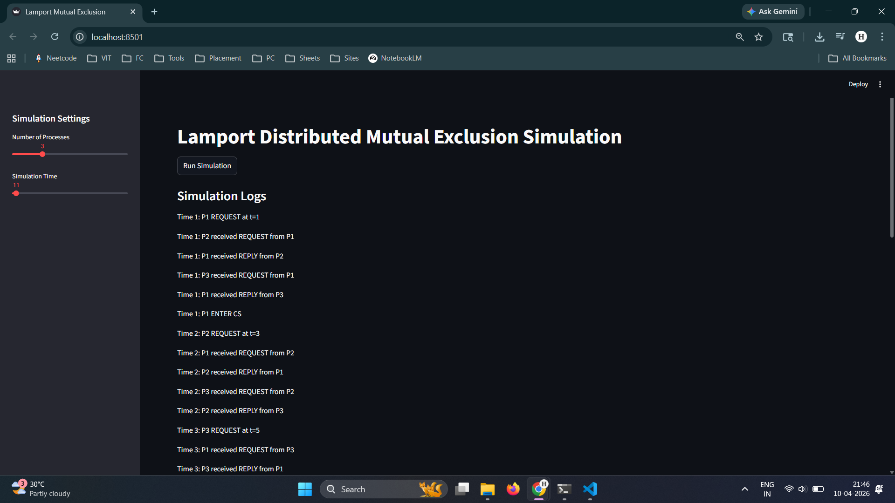
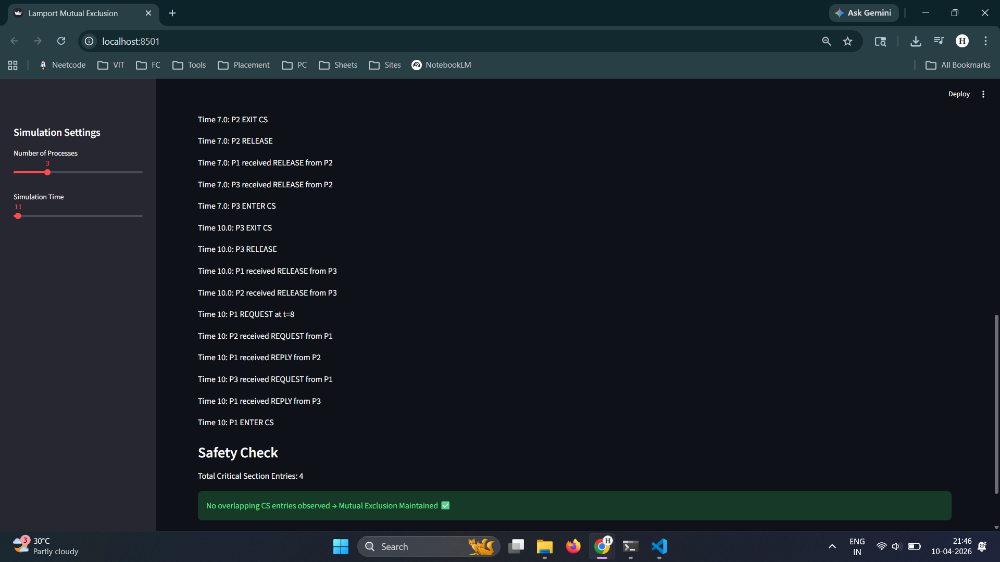

# Lamport Distributed Mutual Exclusion Simulation

## Introduction
This project simulates Lamport's Distributed Mutual Exclusion algorithm using SimPy and Streamlit. It demonstrates how multiple processes coordinate access to a shared Critical Section using only message passing and logical clocks.

---

## Algorithm Phases

### 1. REQUEST
Each process sends a timestamped request to all other processes.

### 2. WAIT
The process waits until:
- It receives replies from all processes
- Its request has the smallest timestamp in the queue

### 3. RELEASE
After exiting the Critical Section, the process sends a RELEASE message to all other processes.

---

## Lamport Clock Rule
- On send → increment clock  
- On receive → clock = max(local, received) + 1  

---

## Safety Property
No two processes enter the Critical Section simultaneously, ensuring mutual exclusion is maintained.

---

## Message Complexity
For N processes:
- REQUEST messages → N - 1  
- REPLY messages → N - 1  
- RELEASE messages → N - 1  

**Total messages = 3(N - 1)**

---

## How to Run

```bash
pip install -r requirements.txt
streamlit run app.py

```

## Sample Output

### Output 1: Initial Request and Entry
This shows processes sending REQUEST messages and the first process entering the Critical Section.



---

### Output 2: Continued Execution
This shows other processes entering the Critical Section sequentially while maintaining mutual exclusion.

